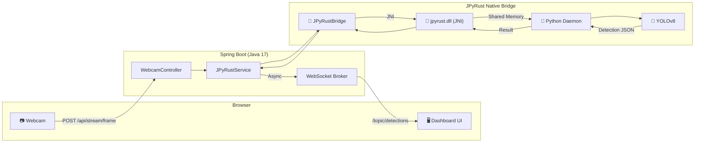

# 🏭 SmartFactory-Vision

> **"Real-Time AI-Powered Factory Inspection: From Webcam to Detection in Milliseconds."**


[](https://openjdk.org/)
[](https://github.com/farmer0010/JPyRust)
[](https://www.python.org/)

[🇰🇷 한국어 버전 (Korean Version)](README_KR.md)

---

## 💡 Introduction

**SmartFactory-Vision** is a real-time AI vision inspection system built with **Spring Boot** and powered by **JPyRust** for native-speed Python AI inference.

It captures webcam frames in the browser, sends them to a Spring Boot backend, runs **YOLOv8 object detection** via the JPyRust native bridge, and pushes detection results back to the client in real-time through **WebSocket (STOMP)**.

---

## ✨ Key Features

| Feature | Description |
|---------|-------------|
| 📷 **Real-Time Webcam Streaming** | Browser-based camera capture at ~25 FPS |
| 🧠 **AI Object Detection** | YOLOv8 inference via JPyRust Shared Memory bridge |
| ⚡ **Native Performance** | ~40ms GPU / ~100ms CPU per frame (no Python VM startup) |
| 📡 **WebSocket Push** | Live detection results via STOMP over SockJS |
| 🖥️ **Sci-Fi Dashboard** | Neon-themed control panel with FPS chart & detection logs |
| 🔄 **Auto-Reconnect** | WebSocket auto-recovery on connection loss |

---

## 🏗️ Architecture



### Data Flow

1. **Capture** — Browser captures webcam frame as JPEG blob (~25 FPS)
2. **Upload** — Frame sent via `POST /api/stream/frame` (multipart)
3. **Inference** — JPyRust processes image through Shared Memory → Python YOLO
4. **Push** — Detection results pushed to browser via WebSocket `/topic/detections`
5. **Render** — Canvas overlay draws bounding boxes with labels and confidence

---

## 📊 Performance

| Metric | Value |
|--------|:-----:|
| **Frame Capture** | ~25 FPS (Browser) |
| **AI Inference (GPU)** | ~40ms / frame |
| **AI Inference (CPU)** | ~100ms / frame |
| **End-to-End Latency** | < 200ms |
| **Python Startup** | 0ms (Persistent Daemon) |

> 💡 GPU auto-detection: NVIDIA CUDA → GPU mode, otherwise CPU fallback. No config needed.

---

## 🖥️ Dashboard

The web dashboard features a **Sci-Fi themed control panel** with:

- 🎥 **Live Video Feed** with scan-line animation overlay
- 📊 **Real-Time FPS Chart** (Chart.js line graph)
- 🎯 **Confidence Gauge** with animated progress bar
- 📋 **Detection Log** with color-coded entries (defects in red)
- 🟢 **Connection Status** indicator (Online/Offline)

---

## 🚀 Quick Start

### Prerequisites

- **Java 17+**
- **Webcam** (built-in or USB)
- **JPyRust v1.2.0** (auto-downloaded via JitPack)

### 1. Clone & Run

```bash
# Clone
git clone https://github.com/farmer0010/SmartFactory-Vision.git
cd SmartFactory-Vision

# Run (first launch downloads ~500MB Python environment)
./gradlew bootRun
```

### 2. Open Dashboard

```
http://localhost:8080
```

Allow camera access when prompted. Detection results appear in real-time.

---

## 📁 Project Structure

```
SmartFactory-Vision/
├── build.gradle.kts              # Dependencies (JPyRust v1.1.6)
├── gradlew / gradlew.bat         # Gradle Wrapper
├── src/main/
│   ├── java/com/smartfactory/vision/
│   │   ├── VisionApplication.java           # Spring Boot Entry
│   │   ├── config/
│   │   │   └── WebSocketConfig.java         # STOMP WebSocket Config
│   │   ├── dashboard/controller/
│   │   │   └── DashboardController.java     # "/" → index.html
│   │   ├── detection/service/
│   │   │   └── JPyRustService.java          # AI Bridge Service
│   │   ├── global/exception/
│   │   │   └── GlobalExceptionHandler.java  # Error Handling
│   │   └── stream/controller/
│   │       └── WebcamController.java        # Frame Upload API
│   └── resources/
│       ├── application.yml                  # Server Config
│       └── templates/
│           └── index.html                   # Dashboard UI
└── README.md
```

---

## ⚙️ Configuration

### `application.yml`

```yaml
server:
  port: 8080
spring:
  application:
    name: SmartFactory-Vision
app:
  ai:
    work-dir: C:/jpyrust_temp
    model-path: yolov8n.pt
```

### `build.gradle.kts`

```kotlin
dependencies {
    implementation("org.springframework.boot:spring-boot-starter-web")
    implementation("org.springframework.boot:spring-boot-starter-websocket")
    implementation("org.springframework.boot:spring-boot-starter-thymeleaf")
    implementation("com.github.farmer0010:JPyRust:v1.2.0")
}
```

---

## 🔧 Troubleshooting

### Q. Camera not showing?
**A.** Ensure browser has camera permission. Use HTTPS or `localhost` only.

### Q. `NoSuchMethodError` on startup?
**A.** Delete any local `com/jpyrust/JPyRustBridge.java` file. The library provides this class.

### Q. `WinError 5` on restart?
**A.** Fixed in JPyRust v1.2.0 (Resolved with native SHMEM security patch).

### Q. WebSocket shows "Offline"?
**A.** Check that port 8080 is not occupied. The WebSocket auto-reconnects every 3 seconds.

---

## 🛠️ Tech Stack

| Layer | Technology |
|-------|-----------|
| **Backend** | Spring Boot 3.2.1, Java 17 |
| **AI Bridge** | JPyRust v1.2.0 (Rust JNI + Python Daemon) |
| **AI Model** | Ultralytics YOLOv8n |
| **Frontend** | Tailwind CSS, Chart.js, SockJS, STOMP.js |
| **Communication** | REST (frame upload), WebSocket (detection push) |

---

## 📜 Version History

| Version | Date | Changes |
|---------|------|---------|
| **v1.2.0** | 2026-02 | **Performance Upgrade:** Windows SHMEM Restoration & Security Fix |
| **v1.0** | 2026-02 | Initial release with real-time YOLO detection and Sci-Fi dashboard |

---

## 📅 Roadmap

- [ ] Multi-camera support
- [ ] Detection alert system (email/SMS)
- [ ] Detection history & analytics dashboard
- [ ] Custom YOLO model training integration
- [ ] Docker deployment support

---

## 📄 License

MIT License

---

<p align="center">
  <b>🏭 SmartFactory-Vision</b><br>
  <i>Built with ☕ Spring Boot + 🦀 JPyRust + 🐍 YOLOv8</i><br>
  <i>Real-Time AI Inspection for Smart Manufacturing.</i>
</p>
