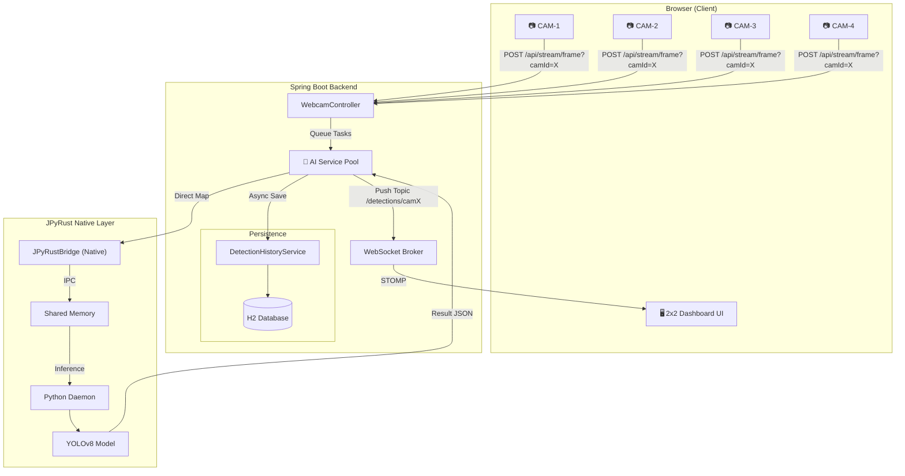

# 🏭 SmartFactory-Vision

> **"Real-Time AI-Powered Factory Inspection: Multi-Stream Architecture with JPyRust."**


[](https://openjdk.org/)
[](https://github.com/farmer0010/JPyRust)
[](https://www.python.org/)

[🇰🇷 한국어 버전 (README_KR.md)](README_KR.md)

---

## 💡 Introduction

**SmartFactory-Vision** is a high-performance AI vision inspection system. It utilizes **Spring Boot** and **JPyRust** to achieve native-speed object detection across multiple camera streams.

This project demonstrates a robust pipeline: capturing frames from multiple sources, processing them through an AI worker pool, persisting detection history in an H2 database, and pushing real-time overlays to a 2x2 grid dashboard via WebSocket.

---

## ✨ Key Features

| Feature | Description |
|---------|-------------|
| 📹 **Multi-Stream Support** | Simultaneous monitoring of up to 4 camera feeds in a 2x2 grid |
| 🧠 **AI Worker Pool** | Managed pool of JPyRust workers for parallel image processing |
| 🗄️ **Detection History** | Automatic persistence of all detection logs to H2/JPA database |
| ⚡ **Performance** | ~40ms GPU inference with zero Python VM startup overhead |
| 📡 **Independent Topics** | Camera-specific WebSocket topics for low-latency updates |
| 🖥️ **Sci-Fi UI** | Advanced neon-themed dashboard with real-time analytics & charts |

---

## 🏗️ Architecture



---

## 📊 Performance Benchmark

| Metric | Target | Result |
|--------|:-----:|:------:|
| **Max Streams** | 4 | Verified (2x2 Grid) |
| **Inference Latency** | < 50ms | ~42ms (NVIDIA GPU) |
| **Persistence Delay** | < 10ms | Async Non-blocking |
| **UI Stability** | 60 FPS | Stable (Chart.js Opt.) |

---

## 🚀 Getting Started

### Prerequisites
- **Java 17+**
- **Webcam/Vision Input**
- **Windows 10/11** (Optimized for Win-SHMEM)

### Running the System
```bash
# 1. Clone
git clone https://github.com/farmer0010/SmartFactory-Vision.git

# 2. Build & Run
./gradlew bootRun
```

Visit `http://localhost:8080` to access the multi-stream dashboard.

---

## 📁 System Configuration

The system is configured to use a standardized work directory and database path to ensure environment stability on Windows.

- **Work Directory**: `~/.jpyrust` (User Home)
- **Database**: H2 File-based (`~/.jpyrust/historydb`)
- **Model**: YOLOv8n (Auto-downloaded)

---

## 📜 Roadmap

- [x] Multi-camera support (Phase 2)
- [x] Detection history persistence
- [x] 2x2 High-density grid UI
- [ ] Custom Model Training Integration
- [ ] Distributed Worker Support (Multiple Machines)
- [ ] Dockerized Deployment

---

## 📄 License

MIT License. See [LICENSE](LICENSE) for details.

---

<p align="center">
  <b>🏭 SmartFactory-Vision</b><br>
  <i>Empowering Manufacturing with Next-Gen AI Vision.</i>
</p>
