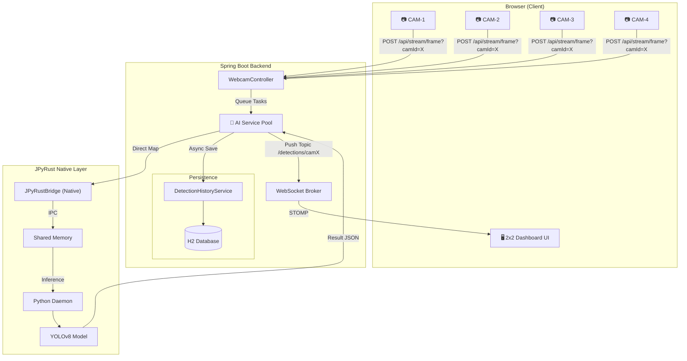

# 🏭 SmartFactory-Vision

> **"Real-Time AI-Powered Factory Inspection: Multi-Stream Architecture with JPyRust."**


[](https://openjdk.org/)
[](https://github.com/farmer0010/JPyRust)
[](https://www.python.org/)

[🇰🇷 한국어 버전 (README_KR.md)](README_KR.md)

---

## 💡 Introduction

**SmartFactory-Vision** is a high-performance AI vision inspection system built with **Spring Boot** and powered by **JPyRust** for native-speed Python AI inference.

The system supports multiple simultaneous camera streams, processing them through a managed AI worker pool, persisting detection history in an H2 database, and pushing real-time overlays to a 2x2 grid dashboard via WebSocket (STOMP).

---

## ✨ Key Features

| Feature | Description |
|---------|-------------|
| 📹 **Multi-Stream Support** | Simultaneous monitoring of up to 4 camera feeds in a 2x2 grid |
| 🧠 **AI Worker Pool** | Managed pool of JPyRust workers for parallel image processing |
| 🗄️ **Detection History** | Automatic persistence of all detection logs to H2/JPA database |
| ⚡ **Performance** | ~40ms GPU / ~100ms CPU per frame (Shared Memory bridge) |
| 📡 **WebSocket Push** | Camera-specific topics for low-latency live results |
| 🖥️ **Sci-Fi Dashboard** | Neon-themed control panel with FPS chart & detection logs |

---

## 🏗️ Architecture



### Data Flow

1. **Capture** — Browser captures webcam frame as JPEG blob (~25 FPS).
2. **Upload** — Frame sent via `POST /api/stream/frame?camId=camX` (multipart).
3. **Inference** — JPyRust processes image through Shared Memory bridge to a persistent Python YOLOv8 daemon.
4. **Persistence** — Detection results are parsed and saved asynchronously to the H2 database.
5. **Push** — Results pushed to specific browser topics (e.g., `/topic/detections/cam1`).
6. **Render** — 2x2 grid UI draws bounding boxes and labels on the corresponding canvas.

---

## 📊 Performance

| Metric | Target | Result |
|--------|:-----:|:------:|
| **Max Streams** | 4 | Verified (2x2 Grid) |
| **AI Inference (GPU)** | < 50ms | ~42ms (NVIDIA CUDA) |
| **AI Inference (CPU)** | < 150ms | ~100ms fallback |
| **Persistence Delay** | < 10ms | Async Non-blocking |
| **End-to-End Latency** | < 250ms | Verified |

---

## 🖥️ Dashboard

The web dashboard features a **Sci-Fi themed control panel** optimized for multi-camera monitoring:

- 🎥 **2x2 Video Grid**: Four simultaneous feeds with scan-line animation.
- 📊 **Real-Time FPS Chart**: Chart.js line graph showing system stability.
- 🎯 **Confidence Gauge**: Animated progress bar for max detection probability.
- 📋 **Integrated Log**: Color-coded detection history (defects highlighted in red).
- 🟢 **Connection Status**: Real-time STOMP connection monitoring.

---

## 🚀 Quick Start

### Prerequisites

- **Java 17+**
- **Webcam** (Internal or USB)
- **Windows 10/11** (Optimized for Native SHMEM)

### 1. Clone & Run

```bash
# Clone
git clone https://github.com/farmer0010/SmartFactory-Vision.git
cd SmartFactory-Vision

# Build & Run (First launch downloads Python env & YOLO model)
./gradlew bootRun
```

### 2. Open Dashboard

Access the interface at: `http://localhost:8080`

> 💡 Allow camera access in the browser. The system will automatically simulate 4 streams using the active camera input.

---

## 📁 Project Structure

```
SmartFactory-Vision/
├── build.gradle.kts              # Dependencies (Spring Boot, JPyRust v1.2.0)
├── gradlew / gradlew.bat         # Gradle Wrapper
├── src/main/
│   ├── java/com/smartfactory/vision/
│   │   ├── VisionApplication.java           # Spring Boot Entry & Async Enable
│   │   ├── dashboard/controller/
│   │   │   ├── DashboardController.java     # View Controller
│   │   │   └── HistoryRestController.java   # History API
│   │   ├── detection/
│   │   │   ├── entity/DetectionLog.java     # JPA Entity
│   │   │   ├── repository/                  # JPA Repository
│   │   │   └── service/
│   │   │       ├── JPyRustService.java      # AI Worker Pool Logic
│   │   │       └── DetectionHistoryService.java # Persistence Logic
│   │   └── stream/controller/
│   │       └── WebcamController.java        # Frame Stream API
│   └── resources/
│       ├── application.yml                  # WorkDir & Database Config
│       └── templates/
│           ├── index.html                   # Multi-stream Dashboard
│           └── history.html                 # Analysis View
└── README.md
```

---

## ⚙️ Configuration

### `application.yml`
```yaml
app:
  ai:
    work-dir: ${user.home}/.jpyrust
    model-path: yolov8n.pt

spring:
  datasource:
    url: jdbc:h2:file:${user.home}/.jpyrust/historydb
```

### `build.gradle.kts`
```kotlin
dependencies {
    implementation("com.github.farmer0010:JPyRust:v1.2.0")
    implementation("org.springframework.boot:spring-boot-starter-data-jpa")
    implementation("com.h2database:h2")
}
```

---

## 🔧 Troubleshooting

### Q. `WinError 5` (Access Denied) error?
**A.** Resolved in JPyRust v1.2.0. Ensure you are using the latest version as standardized in the dependencies.

### Q. Detection results are not persisting?
**A.** Check if H2 database file is created in `~/.jpyrust/`. Ensure `@EnableAsync` is active in `VisionApplication`.

### Q. Camera stream is slow?
**A.** Check if GPU is detected (logs will show "CUDA detected"). If on CPU, try reducing `sendInterval` in `index.html`.

---

## 🛠️ Tech Stack

| Layer | Technology |
|-------|-----------|
| **Backend** | Spring Boot 3.2, Java 17, JPA/Hibernate |
| **AI Bridge** | JPyRust v1.2.0 (Rust JNI + Python Daemon) |
| **Database** | H2 (File-based) |
| **Frontend** | Tailwind CSS, Chart.js, SockJS, STOMP.js |

---

## 📜 Version History

| Version | Date | Changes |
|---------|------|---------|
| **v1.2.1** | 2026-02 | **Maintenance:** Code cleanup and documentation restoration. |
| **v1.2.0** | 2026-02 | **Phase 2:** Multi-Stream (2x2 Grid), Worker Pool, History Persistence. |
| **v1.0.0** | 2026-02 | Initial release with single-stream YOLO detection. |

---

## � Roadmap

- [x] Multi-camera support (Phase 2)
- [x] Detection history persistence
- [x] 2x2 High-density grid UI
- [ ] Custom Model Training Integration
- [ ] Dockerized Deployment

---

## 📄 License

MIT License

---

<p align="center">
  <b>🏭 SmartFactory-Vision</b><br>
  <i>Empowering Manufacturing with Next-Gen AI Vision.</i>
</p>
