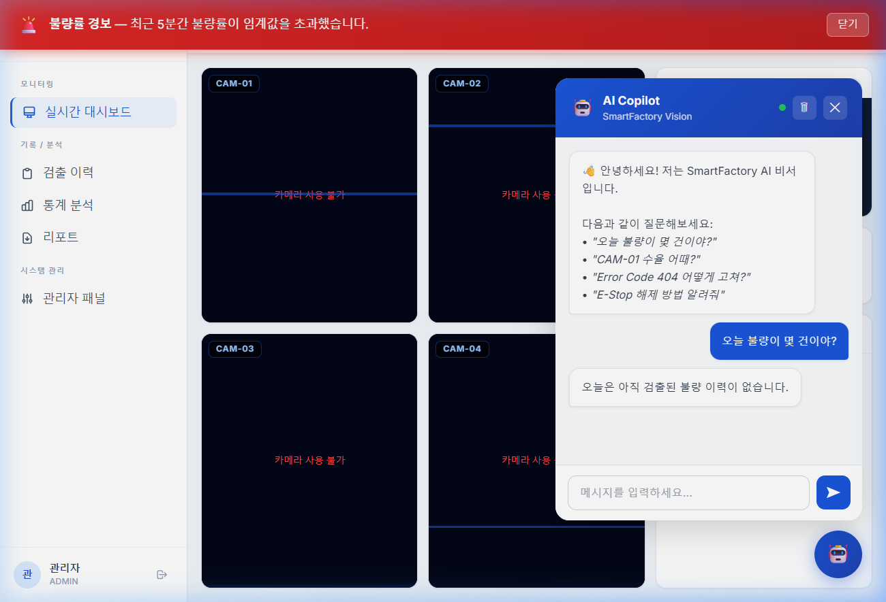
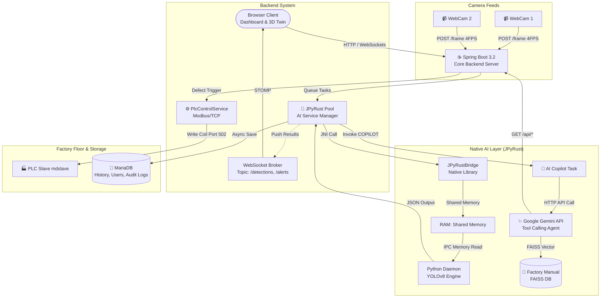
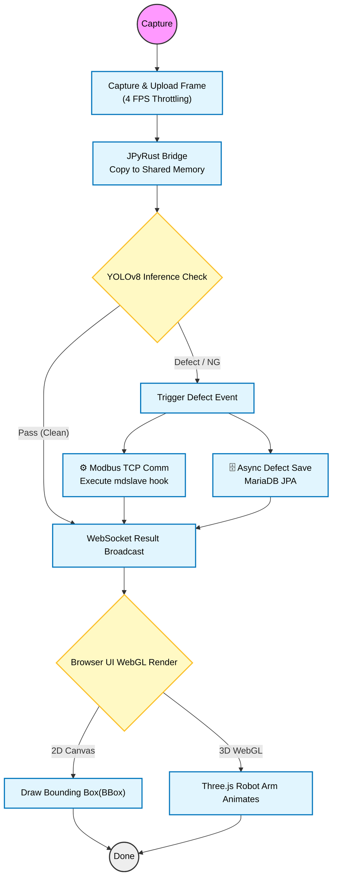
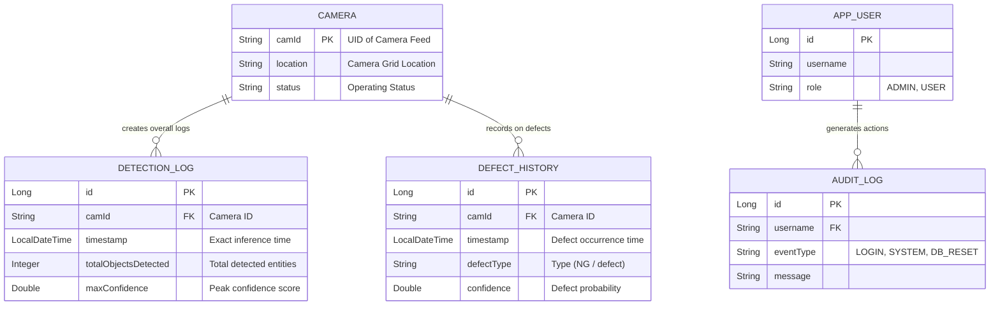
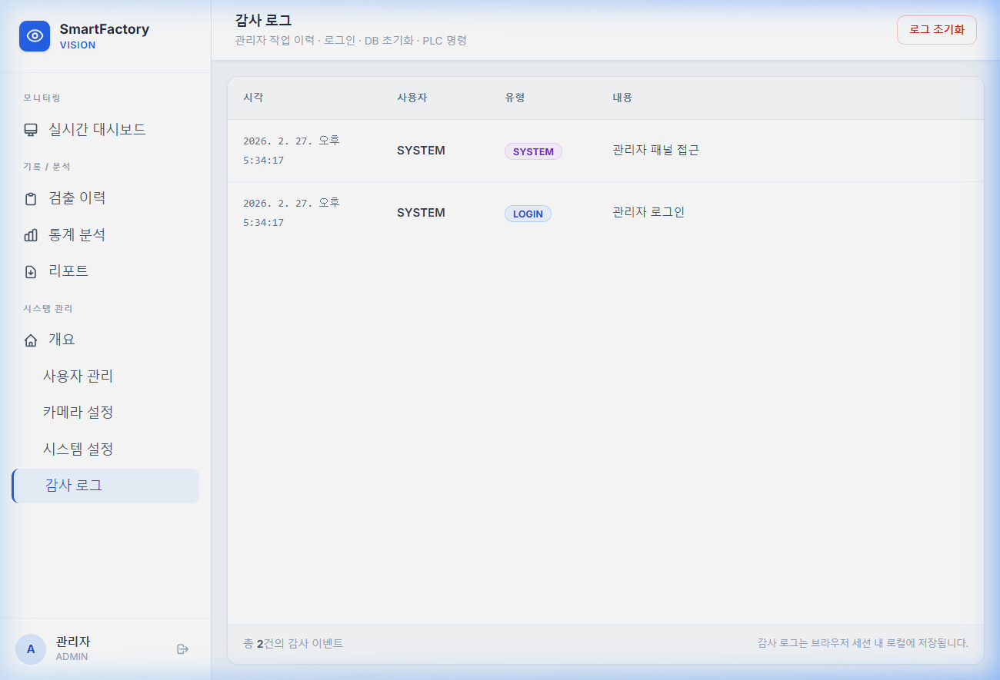

# 🏭 SmartFactory-Vision Ver 1.4.0


> **"Real-Time AI-Powered Factory Inspection System: Multi-Stream Architecture via JPyRust"**<br>
> An intelligent smart factory platform fully equipped with live webcam feeds, ultra-high-speed AI inference (JPyRust), real-time monitoring (3D Digital Twin), and **integration with physical machinery control networks (Soft-PLC)**.


[](https://openjdk.org/)
[](https://github.com/farmer0010/JPyRust)
[](https://www.python.org/)

[🇰🇷 한국어 버전 (README_KR.md)](README_KR.md)

---

## 💡 Introduction

**SmartFactory-Vision** is a practical, real-time AI vision inspection system built on the extreme stability of the **Spring Boot** ecosystem combined with the native AI speed of **JPyRust**.

> 💡 **Powered by Custom Core Technology: JPyRust**
> The core AI inference pipeline of this project is driven by **[JPyRust](https://github.com/farmer0010/JPyRust)**, an independent Native IPC library exclusively designed and developed by the author of this repository. It completely eliminates the heavy network socket communication bottlenecks between Java and Python, achieving ultra-high-speed Zero-Copy data transfers based on C++ Shared Memory limits.

This is not just a blinking monitoring dashboard. It completes parallel image inference across a 4-channel multi-stream environment, and the moment a defect is detected, it immediately controls the switches of actual factory equipment (PLC) to isolate defective products. Furthermore, all detection and control histories are securely backed up in a database, making it a **Full-Stack industrial solution** where administrators can perfectly control all statistics of the production line through a 3D digital twin space and an interactive AI Copilot.

---

## 🏗️ System Architecture

> **Browser - Spring Boot - Native AI - Factory Floor Integrated Architecture**<br>
> Live frames are shunted via JPyRust directly into Native Shared Memory for instant YOLOv8 processing. Findings are subsequently synced real-time to the 3D Digital Twin GUI and the actual Modbus PLC facilities.



<br>

## 🗺️ User Flow & Data Logic

> Core flow highlighting webcam frame capture moving through AI inference, rendering on the 3D layout, over to the physical robot manipulation.



<br>

## 📂 Project Structure

> **Core Architecture:** Layered Architecture (Controller - Service - Repository)<br>

```text
.
├── build.gradle.kts                # Dependencies: Spring Boot, JPyRust, j2mod, MariaDB, JPA
├── src
│   └── main
│       ├── java/com/smartfactory/vision
│       │   ├── VisionApplication.java        # Main Execute (@EnableAsync)
│       │   │
│       │   ├── control                       # [PLC Control]
│       │   │   └── PlcControlService.java    # j2mod based Modbus TCP triggers
│       │   │
│       │   ├── dashboard                     # [Dashboard & API]
│       │   │   ├── controller
│       │   │   │   ├── DashboardController.java
│       │   │   │   └── HistoryRestController.java # [New] Historic log fetch REST APIs
│       │   │   │
│       │   ├── detection                     # [AI Detection & Persistence]
│       │   │   ├── entity
│       │   │   │   ├── DetectionLog.java     # JPA Log Entity
│       │   │   │   └── DefectHistory.java    # Dedicated JPA Defect Entity
│       │   │   ├── repository
│       │   │   │   ├── DetectionLogRepository.java
│       │   │   │   └── DefectHistoryRepository.java
│       │   │   └── service
│       │   │       ├── JPyRustService.java   # JPyRust Worker Pool Setup
│       │   │       └── DetectionHistoryService.java # [New] Async DB Persistence Logic
│       │   │
│       │   └── stream                        # [Stream]
│       │       ├── config/WebSocketConfig.java
│       │       └── controller/WebcamController.java # Multipart upload handler
│       │
│       └── resources
│           ├── application.yml               # DB, Logging, and Directory Configs
│           ├── static/                       # CSS (Tailwind, Neon), JS, Images
│           └── templates/                    # Thymeleaf View Layer
│               ├── index.html                # 2x2 Multi Cam Dashboard Control Panel
│               ├── twin.html                 # 3D Three.js Digital Twin dedicated view
│               └── history.html              # History List UI
│
└── External Modules/                         # [External] Modbus Slave Simulator Guide (bottom)
```

<br>

## 📊 Database Schema (ERD)

> **Entity Relationship Diagram**<br>
> Relational Database constraints for the analytical detection system spanning MariaDB endpoints. (Added Phase 5)



<br>

## 🚀 Key Features

### 1. ⚡ Ultra-fast AI Video Processing (JPyRust Shared Memory IPC)
* **Ultra-low Latency Inference:** Provisioned Shared Memory buffers exist dynamically between JVM heaps and the Python execution engine, completely eviscerating bulky image serialization lags.
* **Isolated Worker Pool:** Assigns an isolated persistent Python process for each independent camera channel allowing threadless, lock-free parallel execution.

### 2. 🗜️ Adaptive Stream Throttling Control
* **4 FPS Auto-Control:** Limits traffic strictly to 4 frames per second per camera. By normalizing inputs, browser thread load minimizes drastically, shutting off Tomcat memory leaks and assuring non-stop factory tracking.

### 3. 🏭 Soft-PLC Modbus Direct Hardware Actions
* **Immediate Interjection:** If a `defect` object passes, `PlcControlService` intercepts and controls physical IO states inside the plant. 
* **Write Coil(0):** Utilizes standard Modbus TCP bindings (Port 502) instructing external PLC Modules or a standard simulated server (`mdslave`) to activate discard actuators.

### 4. 🤖 3D Digital Twin Monitoring (Three.js WebGL)
* **Live Synchronization:** Generates a real-time WebGL robotic structure right on your browser. Any signals dispatched to hardware PLCs replicate across the 3D twin with flashing warning animations directly matching factory motions.

### 5. 🗄️ Persistence & Analytical Storage (MariaDB)
* **Asynchronous Inserts:** Supported by Spring `@Async` threads, log traces and defect alerts deploy to external MariaDB networks simultaneously without blocking critical YOLOv8 visual tasks.

### 6. 🖥️ Hardcore Sci-Fi Monitoring Dashboard
* **2x2 Grid Formats:** Reactively rescales across diverse monitors. Incorporates high-contrast Cyberpunk/Neon CSS traits. 
* **Virtual "Simulate Defect" Protocol:** Contains a specialized bypass button testing the entire hardware/network architecture's behavior safely simulating failures over `mdslave`. 

### 7. 🤖 Generative AI Copilot (Gemini Native Tool Calling)
* **Intelligent Assistant:** Floating chat widget on the dashboard leverages Google Gemini 2.5 Flash.
* **Database & RAG Integration:** The AI agent autonomously invokes Spring Boot REST APIs using HTTP Basic Auth to fetch live daily defect reports and parses FAISS vector DB manuals to instruct operators on Error Codes and E-Stop recovery methods.



### 8. 🚨 Full-Stack Observability & Real-Time Alerts
* **Audit Tracing:** Captures strict `AuditLog` JPA entities tracking Admin logins, system purges, and modifications.
* **Scheduler & WebSocket Alarms:** Evaluates global defect rates every 60 seconds. Triggers a prominent flashing red alert banner across all connected clients via `/topic/alerts` when thresholds (20%) breach within a 5-minute sliding window.

<br>

## ⚙️ Practical Setup & Run Guide

This project is not a simple demo, but a **system linked to actual physical factory control networks (PLC)**. 
Therefore, after cloning it to your local repository for the first time, you must accurately configure the environment variables and camera settings for it to operate normally.

### 1. 📥 Clone & Prerequisites
```bash
git clone https://github.com/farmer0010/SmartFactory-Vision.git
cd SmartFactory-Vision
```
> **⚠️ JPyRust Permission Warning:** 
> Since it uses Native DLL-based Shared Memory in a Windows environment, the Python directory (`C:\Users\{USERNAME}\.jpyrust\python_dist`) must be set up. Adding a Windows Defender exception is recommended if necessary.

### 2. 🔐 Environment Variables (`.env` / `application.yml`)
Do not arbitrarily hardcode important keys in the source code for security reasons. Before running the backend, you must match the following settings:

- **AI Copilot (Gemini API) Access:**
  You must register the following two variables in your System Environment Variables:
  ```env
  GEMINI_API_KEY=YOUR_GOOGLE_GEMINI_API_KEY
  SPRING_BASE_URL=http://localhost:8080
  ```
- **Database (MariaDB):**
  Open the `src/main/resources/application.yml` file and enter the DB information to be operated.
  (The default is configured as `jdbc:mariadb://localhost:3306/smartfactory`, user `root`, and password `smartfactory_pass`. Please ensure you configure this for actual deployment.)

### 3. 📹 Camera Channels & Stream Setup
By default, the screen is configured in a 4-split view (2x2 grid).
Modify the stream source to an RTSP address or `/dev/video0` specification in `src/main/java/com/smartfactory/vision/stream/controller/WebcamController.java` or the frontend HTML according to your operating environment.
> **Note:** Upon your first connection, you must grant **"Camera Usage Permission"** in the browser for the capture logic to start operating.

### 4. 🚀 Modbus Slave (mdslave) Simulation Guide
To check the logic linked to the actual industrial PLC when a defect is detected, a **virtual Modbus simulator (mdslave)** MUST be running in the background to avoid 400 errors.

1. Install `pyModbusTCP` in your Python environment:
   ```bash
   pip install pyModbusTCP
   ```
2. Save the following code as `mdslave.py` and run it to open local port 502:
   ```python
   from pyModbusTCP.server import ModbusServer
   server = ModbusServer(host="127.0.0.1", port=502, no_block=True)
   print("Modbus Slave Server Running... (Port: 502)")
   server.start()
   while True: pass
   ```

### 5. Build & Execute
Once communication preparations are complete, start the Spring Boot server.
```bash
# 1. Gradle Build (Skip Tests)
gradlew.bat clean build -x test

# 2. Run Application
gradlew.bat bootRun
```

### 6. Main Access Endpoints
* **Main Control Dashboard:** `http://localhost:8080/`
* **3D Digital Twin Standalone View:** `http://localhost:8080/twin`
* **Admin Audit Log Panel:** `http://localhost:8080/admin/audit`

> **Tip:** Clicking the **"Simulate Defect"** virtual test button at the bottom allows you to safely check 100% whether the Modbus control network transmission/reception and the 3D twin's emergency flashing logic are working properly, without having to drop actual defective products.

<br>

## 🛠 Tech Stack

| Layer | Specialization Utilities & Frameworks |
| :--- | :--- |
| **Backend Core** | Java 17, **Spring Boot 3.2.1**, Spring WebSockets, Spring Data JPA |
| **AI Inference** | **JPyRust (v1.3.1)**, Shared Memory C/C++ Binding, **YOLOv8** (Python 3.12) |
| **Data Persistence** | **MariaDB 10.x**, H2 Database (Dev only) |
| **IoT Control**| **j2mod** (Java Modbus), Soft-PLC (`mdslave`) |
| **Frontend UI** | HTML5 Canvas Arrays, Vanilla JS, **Three.js** (WebGL 3D Models), Chart.js |
| **Infra & DevOps** | Gradle, Git Versioning |

<br>

## 📜 Version History

| Ver | Date | Enhancements |
|---------|------|---------|
| **v1.4.0** | 2026-02 | **Phase 6/7 Enhancement:** Added interactive Gemini AI Copilot, Audit Log Panel, Real-time WebSocket Alarms, PDF Report Generations, Thymeleaf UI components. |
| **v1.3.0** | 2026-02 | **Phase 3/4/5:** Soft-PLC Modbus hardware commands, 3D WebGL Digital Twin structures, MariaDB relational persistence integrations. |
| **v1.2.1** | 2026-02 | **Maintenance:** Codebase optimizations, documentation styling upgraded to (42Cabi) styles. |
| **v1.2.0** | 2026-02 | **Phase 2:** Multi Stream (2x2 Grid), Async Worker Pool infrastructural advancements. |
| **v1.0.0** | 2026-02 | Solo feed YOLO detection & STOMP pipeline initial release. |

<br>

## 📅 Roadmap

- [x] Multi-camera capability completion (Phase 2)
- [x] Soft-PLC live physics hardware controls (Phase 3)
- [x] WebGL 3D graphical digital twin (Phase 4)
- [x] Defect database history archive system (Phase 5)
- [x] Gemini AI Copilot Integration & Alerting (Phase 6/7)
- [ ] Implement Dockerized independent microservice distributions & CI/CD networks.

<br>

## 📄 License
MIT License.

<br>
<p align="center">
  <b>🏭 SmartFactory-Vision</b><br>
  <i>Supercharging production via Next-Gen IT architectures.</i>
</p>
