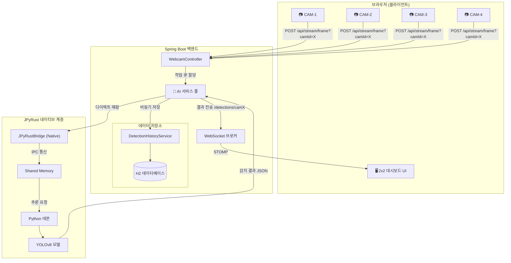

# 🏭 SmartFactory-Vision

> **"실시간 AI 기반 공장 검사 시스템: JPyRust를 이용한 멀티 스트림 아키텍처"**


[](https://openjdk.org/)
[](https://github.com/farmer0010/JPyRust)
[](https://www.python.org/)

[🇺🇸 English Version (README.md)](README.md)

---

## 💡 소개

**SmartFactory-Vision**은 **Spring Boot**와 **JPyRust**를 결합하여 네이티브 수준의 성능을 제공하는 실시간 AI 비전 검사 시스템입니다.

본 시스템은 여러 대의 카메라 피드를 동시에 캡처하고, 관리되는 AI 워커 풀을 통해 병렬 이미지 추론을 수행하며, 감지 이력을 H2 데이터베이스에 저장하고 그 결과를 2x2 그리드 대시보드에 실시간으로 전송(WebSocket/STOMP)합니다.

---

## ✨ 핵심 기능

| 기능 | 설명 |
|---------|-------------|
| 📹 **멀티 스트림 지원** | 2x2 그리드 레이아웃을 통해 최대 4개 카메라 채널 동시 모니터링 |
| 🧠 **AI 워커 풀** | JPyRust 인스턴스 풀을 관리하여 병렬 이미지 추론 수행 |
| 🗄️ **감지 이력 저장** | 모든 AI 감지 로그를 H2/JPA를 통해 데이터베이스에 자동 저장 |
| ⚡ **고성능 추론** | GPU 기준 장당 약 40ms의 고속 추론 (Shared Memory 브릿지 사용) |
| 📡 **독립적 토픽** | 카메라별 실시간 WebSocket 토픽 분리를 통한 지연율 최소화 |
| 🖥️ **Sci-Fi UI** | 네온 테마의 대시보드, 실시간 FPS 차트 및 감지 로그 제공 |

---

## 🏗️ 시스템 아키텍처



### 데이터 흐름

1. **캡처** — 브라우저에서 웹캠 프레임을 JPEG Blob으로 캡처 (~25 FPS).
2. **업로드** — `POST /api/stream/frame?camId=camX`를 통해 프레임 전송 (Multipart).
3. **추론** — JPyRust 네이티브 브릿지를 통해 Persistent Python YOLOv8 데몬으로 이미지 처리.
4. **저장** — 감지 결과가 파싱되어 H2 데이터베이스에 비동기적으로 저장됨.
5. **전송** — 특정 카메라 토픽(예: `/topic/detections/cam1`)으로 결과 푸시.
6. **렌더링** — 2x2 그리드 UI의 해당 캔버스에 경계 상자(Bounding Box)와 라벨을 그림.

---

## 📊 성능 지표

| 지표 | 목표 | 결과 |
|--------|:-----:|:------:|
| **최대 스트림 수** | 4 | 확인 완료 (2x2 그리드) |
| **추론 지연율 (GPU)** | < 50ms | 약 42ms (NVIDIA CUDA) |
| **추론 지연율 (CPU)** | < 150ms | 약 100ms (Fallback) |
| **저장 지연율** | < 10ms | 비동기 논블로킹 처리 완료 |
| **엔드 투 엔드 지연** | < 250ms | 확인 완료 |

---

## 🖥️ 대시보드

멀티 카메라 모니터링에 최적화된 **Sci-Fi 테마 제어판** 기능:

- 🎥 **2x2 비디오 그리드**: 스캔라인 애니메이션이 포함된 4개 동시 피드.
- 📊 **실시간 FPS 차트**: 시스템 안정성을 보여주는 Chart.js 라인 그래프.
- 🎯 **신뢰도 게이지**: 최대 감지 확률을 보여주는 애니메이션 프로그레스 바.
- 📋 **통합 로그**: 색상별 감지 이력 (결함은 빨간색으로 강조).
- 🟢 **연결 상태**: 실시간 STOMP 연결 모니터링 표시기.

---

## 🚀 시작하기

### 사전 요구 사항

- **Java 17+**
- **웹캠** (내장 또는 USB)
- **Windows 10/11** (Shared Memory 사용 최적화)

### 1. 복제 및 실행

```bash
# Clone
git clone https://github.com/farmer0010/SmartFactory-Vision.git
cd SmartFactory-Vision

# Build & Run (최초 실행 시 Python 환경 및 YOLO 모델 다운로드)
./gradlew bootRun
```

### 2. 대시보드 접속

브라우저에서 접속: `http://localhost:8080`

> 💡 브라우저의 카메라 접근 권한을 허용해 주세요. 시스템은 활성화된 카메라 입력을 사용하여 4개의 스트림을 자동으로 시뮬레이션합니다.

---

## 📁 프로젝트 구조

```
SmartFactory-Vision/
├── build.gradle.kts              # 의존성 설정 (Spring Boot, JPyRust v1.2.0)
├── gradlew / gradlew.bat         # Gradle 래퍼
├── src/main/
│   ├── java/com/smartfactory/vision/
│   │   ├── VisionApplication.java           # Spring Boot 엔트리 및 비동기 설정
│   │   ├── dashboard/controller/
│   │   │   ├── DashboardController.java     # 뷰 컨트롤러
│   │   │   └── HistoryRestController.java   # 이력 조회 API
│   │   ├── detection/
│   │   │   ├── entity/DetectionLog.java     # JPA 엔티티
│   │   │   ├── repository/                  # JPA 레포지토리
│   │   │   └── service/
│   │   │       ├── JPyRustService.java      # AI 워커 풀 로직
│   │   │       └── DetectionHistoryService.java # 영속성 저장 로직
│   │   └── stream/controller/
│   │       └── WebcamController.java        # 프레임 스트림 API
│   └── resources/
│       ├── application.yml                  # 작업 경로 및 DB 설정
│       └── templates/
│           ├── index.html                   # 멀티 스트림 대시보드
│           └── history.html                 # 분석 이력 뷰
└── README_KR.md
```

---

## ⚙️ 상세 설정

### `application.yml`
```yaml
app:
  ai:
    work-dir: ${user.home}/.jpyrust
    model-path: yolov8n.pt

spring:
  datasource:
    url: jdbc:h2:file:${user.home}/.jpyrust/historydb
```

### `build.gradle.kts`
```kotlin
dependencies {
    implementation("com.github.farmer0010:JPyRust:v1.2.0")
    implementation("org.springframework.boot:spring-boot-starter-data-jpa")
    implementation("com.h2database:h2")
}
```

---

## 🔧 문제 해결 (Troubleshooting)

### Q. `WinError 5` (액세스 거부) 오류가 발생합니다.
**A.** JPyRust v1.2.0에서 수정되었습니다. 의존성 설정에 명시된 최신 버전을 사용 중인지 확인하세요.

### Q. 감지 결과가 저장되지 않습니다.
**A.** `~/.jpyrust/` 경로에 H2 데이터베이스 파일이 생성되었는지 확인하세요. `VisionApplication`에 `@EnableAsync`가 누락되지 않았는지 확인하세요.

### Q. 카메라 스트림이 느립니다.
**A.** GPU 감지 여부를 확인하세요 (로그에 "CUDA detected" 표시). CPU 사용 시 `index.html`의 `sendInterval` 값을 조절해 보세요.

---

## 🛠️ 기술 스택

| 계층 | 기술 |
|-------|-----------|
| **백엔드** | Spring Boot 3.2, Java 17, JPA/Hibernate |
| **AI 브릿지** | JPyRust v1.2.0 (Rust JNI + Python Daemon) |
| **데이터베이스** | H2 (파일 기반) |
| **프론트엔드** | Tailwind CSS, Chart.js, SockJS, STOMP.js |

---

## 📜 버전 히스토리

| 버전 | 날짜 | 주요 변경 사항 |
|---------|------|---------|
| **v1.2.1** | 2026-02 | **유지보수:** 코드 클린업 및 문서 복구. |
| **v1.2.0** | 2026-02 | **2단계:** 멀티 스트림(2x2 그리드), 워커 풀, 이력 저장 기능 추가. |
| **v1.0.0** | 2026-02 | YOLO 감지 및 기초 대시보드 최초 릴리즈. |

---

## 📅 로드맵

- [x] 멀티 카메라 지원 (2단계 완료)
- [x] 감지 이력 데이터베이스 저장 구현
- [x] 2x2 고해상도 그리드 UI 적용
- [ ] 사용자 정의 모델 학습 연동 기능
- [ ] 분산 워커 지원 (여러 대의 PC로 확장)
- [ ] Docker 배포 지원

---

## 📄 라이선스

MIT License.

---

<p align="center">
  <b>🏭 SmartFactory-Vision</b><br>
  <i>차세대 AI 비전 기술로 스마트 제조 공정을 혁신합니다.</i>
</p>
