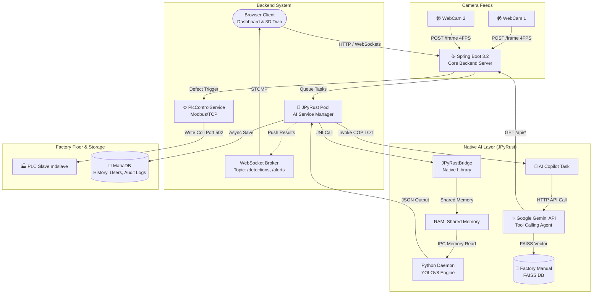
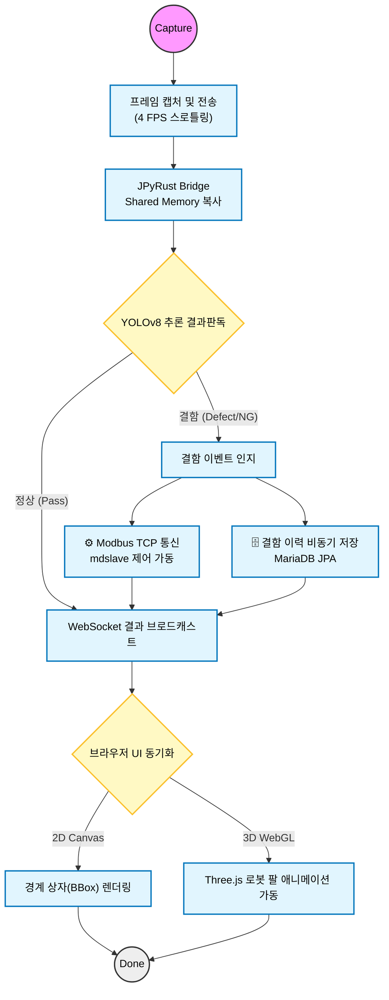
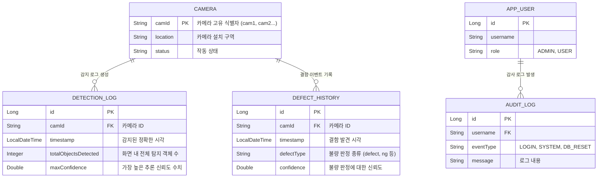

# 🏭 SmartFactory-Vision Ver 1.4.0


> **"실시간 AI 기반 공장 검사 시스템: JPyRust를 이용한 멀티 스트림 아키텍처"**<br>
> 사용자의 웹캠 피드, 초고속 AI 추론(JPyRust), 실시간 모니터링(3D 디지털 트윈), 그리고 **시스템의 실물 제어망(Soft-PLC)**을 모두 갖춘 지능형 스마트 팩토리 플랫폼입니다.


[](https://openjdk.org/)
[](https://github.com/farmer0010/JPyRust)
[](https://www.python.org/)

[🇺🇸 English Version (README.md)](README.md)

---

## 💡 소개 (Introduction)

**SmartFactory-Vision**은 **Spring Boot**와 **JPyRust**를 결합하여 네이티브 수준의 성능을 제공하는 실시간 AI 비전 검사 시스템입니다. 

기존의 단순 모니터링을 넘어서, 4채널 멀티 스트림 환경에서 병렬 이미지 추론을 수행하며, 감지 이력을 DB에 저장하고, 실물 공장 설비(PLC)와 연동하여 불량 발생 시 물리적인 액션을 즉각 트리거하는 Full-Stack 산업 솔루션입니다.

---

## 🏗️ System Architecture (시스템 아키텍처)

> **Browser - Spring Boot - Native AI - Factory Floor 통합 아키텍처**<br>
> 실시간 프레임을 Native Shared Memory로 전송 후 YOLOv8 추론을 수행하며, 결과를 3D 디지털 트윈과 물리 PLC 설비에 실시간 동기화합니다.



<br>

## 🗺️ User Flow & Data Logic (데이터 처리 흐름도)

> 웹캠 프레임 캡처부터 AI 인퍼런스, 3D 렌더링, 실제 로봇 팔 제어까지의 주요 프로세스입니다.



<br>

## 📂 Project Structure (상세 프로젝트 구조)

> **Core Architecture:** Layered Architecture (Controller - Service - Repository)<br>
> Spring Boot 기반 MVC 모델과 JPyRust Native Bridge 통합 구조입니다.

```text
.
├── build.gradle.kts                # 의존성: Spring Boot, JPyRust, j2mod, MariaDB, JPA
├── src
│   └── main
│       ├── java/com/smartfactory/vision
│       │   ├── VisionApplication.java        # 메인 실행 파일 (@EnableAsync 적용)
│       │   │
│       │   ├── control                       # [PLC Control] 제어 모듈
│       │   │   └── PlcControlService.java    # j2mod 기반 Modbus TCP 통신 및 트리거 로직
│       │   │
│       │   ├── dashboard                     # [Dashboard & API] 뷰 라우팅 및 데이터 API
│       │   │   ├── controller
│       │   │   │   ├── DashboardController.java
│       │   │   │   └── HistoryRestController.java # [New] 감지 이력 및 통계 조회 REST API
│       │   │   │
│       │   ├── detection                     # [AI Detection & Persistence]
│       │   │   ├── entity
│       │   │   │   ├── DetectionLog.java     # 감지 로그 JPA 엔티티 (전체 객체수, 신뢰도 포함)
│       │   │   │   └── DefectHistory.java    # 결함 전용 JPA 엔티티
│       │   │   ├── repository
│       │   │   │   ├── DetectionLogRepository.java
│       │   │   │   └── DefectHistoryRepository.java
│       │   │   └── service
│       │   │       ├── JPyRustService.java   # JPyRust 기반 Worker Pool (카메라 동시 접속 처리)
│       │   │       └── DetectionHistoryService.java # [New] DB 비동기(@Async) 로그 저장 로직
│       │   │
│       │   └── stream                        # [Stream] 카메라 피드 처리
│       │       ├── config/WebSocketConfig.java
│       │       └── controller/WebcamController.java # 이미지 Multipart 수신 처리
│       │
│       └── resources
│           ├── application.yml               # DB (MariaDB/H2), 로깅, 디렉토리 설정
│           ├── static/                       # CSS (Tailwind 등), JS, Image Assets
│           └── templates/                    # Thymeleaf 뷰 레이어
│               ├── index.html                # 메인 2x2 멀티 카메라 & 컨트롤 패널
│               ├── twin.html                 # Three.js 3D 디지털 트윈 단독 뷰
│               └── history.html              # 감지 이력 대시보드
│
└── 외부 연동/                                 # [External] Modbus Slave 시뮬레이터 연동 (본문 하단 가이드)
```

<br>

## 📊 Database Schema (ERD)

> **Entity Relationship Diagram**<br>
> 결함 이력 저장 및 통계 분석을 위한 관계형 데이터베이스(MariaDB) 구조입니다. (Phase 5 반영)



<br>

## 🚀 Key Features (상세 핵심 기능)

### 1. ⚡ 초고속 AI 영상 처리 인프라 (JPyRust Shared Memory IPC)
* **초저지연 추론:** JVM 메모리와 Python 엔진 공간 사이에 Shared Memory를 할당하여 거대한 이미지 프레임 직렬화 지연을 완벽히 제거했습니다.
* **비동기 Worker Pool:** 카메라 채널마다 격리된 Python 프로세스를 할당하여 멀티 스트림에서도 스레드 병목 현상 없이 병렬 파이프라인 처리가 가능합니다.

### 2. 🗜️ 네트워크 혼잡 방지 능동 제어 (Stream Throttling)
* **초당 4 FPS 최적화:** 브라우저 캡처 부하 및 Tomcat 리소스 과소비를 방지하기 위해 각 카메라의 트래픽을 초당 4프레임으로 제한하여 안정성과 메모리 누수를 억제합니다.

### 3. 🏭 Soft-PLC Modbus 기반 실물 제어 (Hardware Integration)
* **결함 즉각 개입:** `defect` 객체가 감지되면 Spring Boot의 `PlcControlService`가 실시간으로 통신 프로토콜을 탈취합니다.
* **Write Coil(0):** Modbus TCP 포트 502를 통해 외부 PLC 모듈 혹은 시뮬레이터(`mdslave`)의 Coil 번호를 제어하여 하드웨어 액추에이터를 즉시 가동합니다.

### 4. 🤖 3D 디지털 트윈 모니터링 (Three.js WebGL Twin)
* **실시간 동기화:** 브라우저 WebGL 캔버스에 로봇 팔 모델을 렌더링하고, 실제 결함 발견 시 하드웨어(PLC)가 수행하는 가동 모션을 가상 환경에서도 붉게 점멸하며 똑같이 애니메이션합니다.

### 5. 🗄️ 백업 및 분석망 구축 (MariaDB / H2 Persistence)
* **비동기 이력 보관:** `@Async` 어노테이션이 탑재된 서비스 레이어에서 추론된 데이터의 메타정보를 MariaDB(혹은 로컬 H2)에 논블로킹으로 안전하게 보관합니다.

### 6. 🖥️ 하드코어 Sci-Fi 대시보드 및 가상 테스트 모드
* **2x2 그리드 UI:** 네온 그린과 다크 테마 기반의 반응형 그리드 화면으로 여러 채널을 끊김 없이 송출합니다.
* **"Simulate Defect" 모드:** 실물 설비의 훅업 상태를 실제 불량품을 흘리지 않고도 버튼 하나로 통합 테스트할 수 있는 내장 가상 트리거를 지원합니다.

### 7. 🤖 생성형 AI Copilot (Gemini Native Tool Calling)
* **지능형 비서:** 대시보드 하단의 챗봇 위젯을 통해 구글 Gemini 2.5 Flash를 대화형으로 호출합니다.
* **다이나믹 도구 연동 (RAG+DB):** AI가 스스로 질문을 분석하여, REST API에 접속해 금일 불량 통계를 조회하거나, FAISS 벡터 데이터베이스에 저장된 공장 매뉴얼 가이드(`factory_manual.txt`)를 읽어 E-Stop 해제 및 404 에러 대응법을 사용자에게 브리핑합니다.


### 8. 🚨 실시간 보안 감사 및 웹소켓 알림 시스템
* **스프링 감사 로그 (Audit Tracing):** 관리자의 로그인, 시스템 초기화 내역을 감지하여 DB Entity에 영구 저장 및 패널에 출력합니다.
* **스케줄러 기반 위험 경보:** 매 1분마다 지난 5분간의 전사적 불량률을 모니터링하며, 임계치(20%)를 초과할 경우 접속 중인 모든 사용자에게 붉은 알림 배너를 강제 푸시(`/topic/alerts`)하여 공장 라인 중단 점검을 강제시킵니다.

<br>

## ⚙️ Setup & Run

### 1. 요구 사항 및 사전 설정
* **OS:** Windows 환경 (Shared Memory Native DLL 호환성)
* **Python 디렉토리:** JPyRust 엔진을 위해 `C:\Users\{사용자명}\.jpyrust\python_dist` 경로 환경이 구성되어 있어야 합니다.

### 2. Database 연결 (MariaDB)
`src/main/resources/application.yml` 내 DB 정보가 MariaDB를 바라보고 있습니다.
* URL: `jdbc:mariadb://localhost:3306/smartfactory`
* 기본 User: `root` (비밀번호 없음 설정)
* *(테스트 목적으로만 구동하려면 url을 h2 파일 시스템으로 롤백하거나 MariaDB 서비스를 설치하세요.)*

### 3. Modbus Slave (mdslave) 구동 가이드 🚀
프로젝트에서 불량 감지 시 실제 산업용 PLC와 연동하는 로직을 점검하기 위해, **Modbus 시뮬레이터(mdslave)**가 반드시 백그라운드에 띄워져 있어야 합니다.

1. **라이브러리 추가:** Python(로컬 또는 가상환경)을 통해 Modbus 라이브러리를 설치합니다.
   ```bash
   pip install pyModbusTCP
   ```
2. **시뮬레이터 스크립트 실행:** 아래 코드를 복사하여 `mdslave.py` 로 저장하고 실행합니다. 포트는 일반적인 PLC 표준인 `502`로 설정되며, 루프백 주소 `127.0.0.1`에 바인딩됩니다.
   ```python
   from pyModbusTCP.server import ModbusServer
   # 127.0.0.1 (로컬호스트) 포트 502로 서버 오픈
   server = ModbusServer(host="127.0.0.1", port=502, no_block=True)
   
   try:
       print("Modbus Slave Server 동작 중... (Port: 502)")
       server.start()
       while True:
           # 주기적으로 모니터링 하거나 상시 대기
           pass
   except KeyboardInterrupt:
       server.stop()
       print("서버 중지됨")
   ```
3. **가동 확인:** 백엔드 콘솔과 Spring MVC가 동작 중 결함을 판정하면 "PLC trigger success" 또는 Coil 상태가 변경되었음을 백엔드 로그창에서 확인할 수 있습니다.

### 4. 빌드 및 애플리케이션 시작
```bash
# 1. Gradle 빌드
gradlew.bat clean build -x test

# 2. 애플리케이션 로드 (8080 포트)
gradlew.bat bootRun
```

### 5. 주요 접속 엔드포인트
* **메인 관제 대시보드:** `http://localhost:8080/`
* **3D 디지털 트윈 单독뷰:** `http://localhost:8080/twin`
* **시스템 이력 및 로그:** `http://localhost:8080/history` *(개발중)*

> **Tip:** 브라우저 첫 접근 시 "카메라 사용 권한"을 먼저 허용해 주시면 즉각 4분할 스트림 시뮬레이션이 가동됩니다. 하단의 가상 테스트 "Simulate Defect" 버튼을 통해 Modbus 제어망과의 송수신 정상 작동 여부를 바로 점검해보세요!

<br>

## 🛠 Tech Stack

| 분류 | 기술 스택 핵심 역량 |
| :--- | :--- |
| **Backend Core** | Java 17, **Spring Boot 3.2.1**, Spring WebSockets, Spring Data JPA |
| **AI Inference** | **JPyRust (v1.3.1)**, Shared Memory C/C++ 브릿지, **YOLOv8** (Python 3.12) |
| **Data Persistence** | **MariaDB 10.x**, H2 Database (개발용) |
| **IoT Control**| **j2mod** (Java Modbus), Soft-PLC (mdslave 연동) |
| **Frontend UI** | HTML5 Canvas 실시간 렌더링, Vanilla JS, **Three.js** (WebGL 3D 모델 관리), Chart.js |
| **Infra & DevOps** | Gradle, Git |

<br>

## 📜 Version History (버전 히스토리)

| 버전 | 날짜 | 주요 변경 사항 |
|---------|------|---------|
| **v1.4.0** | 2026-02 | **Phase 6/7 Enhancement:** Gemini AI Copilot 도입, 관리자 감사 로그 통합, 실시간 WebSocket 경보 배너 등 풀스택 대규모 확장 적용 |
| **v1.3.0** | 2026-02 | **Phase 3/4/5:** Soft-PLC(Modbus) 제어 연동, 3D 디지털 트윈, MariaDB 저장 레이어 추가 |
| **v1.2.1** | 2026-02 | **Maintenance:** 코드 최적화 및 문서 컨벤션(42Cabi Style) 적용 |
| **v1.2.0** | 2026-02 | **Phase 2:** 멀티 스트림(2x2 그리드), JPyRust 워커 풀 비동기 인프라 고도화 |
| **v1.0.0** | 2026-02 | YOLO 실시간 감지 및 WebSocket 브로드캐스트 기초 통신 릴리즈 |

<br>

## 📅 Roadmap

- [x] Multi-camera 지원 고밀도 인프라 완성 (Phase 2)
- [x] Soft-PLC 실시간 물리 설비 제어망 통합 (Phase 3)
- [x] WebGL 3D 기반 디지털 트윈 모니터링 구현 (Phase 4)
- [x] 감지 이력 및 이벤트 백업 데이터베이스(DB) 보관 파이프라인 (Phase 5)
- [x] Gemini AI Copilot 통합 및 웹소켓 알림 시스템 구축 (Phase 6/7)
- [ ] Dockerized 완전 독립 배포 지원 및 CI/CD 구축

<br>

## 📄 라이선스
MIT License

<br>
<p align="center">
  <b>🏭 SmartFactory-Vision</b><br>
  <i>차세대 IT 인프라로 제조업의 초고속 지능화를 이뤄냅니다.</i>
</p>
