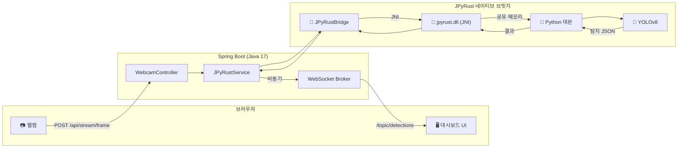

# 🏭 SmartFactory-Vision

> **"실시간 AI 공장 검사: 웹캠에서 탐지까지 밀리초 단위로."**


[](https://openjdk.org/)
[](https://github.com/farmer0010/JPyRust)
[](https://www.python.org/)

[🇺🇸 English Version](README.md)

---

## 💡 소개

**SmartFactory-Vision**은 **Spring Boot** 기반의 실시간 AI 비전 검사 시스템입니다.
**JPyRust** 네이티브 브릿지를 통해 Python AI 추론을 네이티브에 가까운 속도로 실행합니다.

브라우저에서 웹캠 프레임을 캡처하고, Spring Boot 백엔드로 전송한 뒤, JPyRust 네이티브 브릿지를 통해 **YOLOv8 객체 탐지**를 실행하고, **WebSocket (STOMP)**을 통해 실시간으로 결과를 클라이언트에 전송합니다.

---

## ✨ 주요 기능

| 기능 | 설명 |
|------|------|
| 📷 **실시간 웹캠 스트리밍** | 브라우저 기반 카메라 캡처 (~25 FPS) |
| 🧠 **AI 객체 탐지** | JPyRust 공유 메모리 브릿지를 통한 YOLOv8 추론 |
| ⚡ **네이티브 성능** | 프레임당 GPU ~40ms / CPU ~100ms (Python VM 시작 없음) |
| 📡 **WebSocket 실시간 푸시** | SockJS 위 STOMP를 통한 탐지 결과 실시간 전송 |
| 🖥️ **SF 테마 대시보드** | FPS 차트 및 탐지 로그가 포함된 네온 테마 컨트롤 패널 |
| 🔄 **자동 재연결** | 연결 끊김 시 WebSocket 자동 복구 |

---

## 🏗️ 아키텍처



### 데이터 흐름

1. **캡처** — 브라우저가 웹캠 프레임을 JPEG blob으로 캡처 (~25 FPS)
2. **업로드** — `POST /api/stream/frame`으로 프레임 전송 (multipart)
3. **추론** — JPyRust가 공유 메모리 → Python YOLO를 통해 이미지 처리
4. **푸시** — WebSocket `/topic/detections`를 통해 탐지 결과를 브라우저로 전송
5. **렌더링** — Canvas 오버레이에 바운딩 박스, 라벨, 신뢰도 표시

---

## 📊 성능

| 지표 | 수치 |
|------|:----:|
| **프레임 캡처** | ~25 FPS (브라우저) |
| **AI 추론 (GPU)** | ~40ms / 프레임 |
| **AI 추론 (CPU)** | ~100ms / 프레임 |
| **종단 간 지연** | < 200ms |
| **Python 시작** | 0ms (상주 데몬) |

> 💡 GPU 자동 감지: NVIDIA CUDA 설치 시 → GPU 모드, 미설치 시 CPU 자동 전환. 설정 불필요.

---

## 🖥️ 대시보드

**SF 테마 컨트롤 패널** 웹 대시보드:

- 🎥 **라이브 비디오 피드** — 스캔라인 애니메이션 오버레이
- 📊 **실시간 FPS 차트** — Chart.js 라인 그래프
- 🎯 **신뢰도 게이지** — 애니메이션 프로그레스 바
- 📋 **탐지 로그** — 색상 코딩 (불량: 빨강, 정상: 청색)
- 🟢 **연결 상태 표시기** — Online/Offline

---

## 🚀 시작하기

### 사전 준비

- **Java 17+**
- **웹캠** (내장 또는 USB)
- **JPyRust v1.1.6** (JitPack 통해 자동 다운로드)

### 1. 클론 및 실행

```bash
# 클론
git clone https://github.com/farmer0010/SmartFactory-Vision.git
cd SmartFactory-Vision

# 실행 (첫 실행 시 ~500MB Python 환경 자동 다운로드)
./gradlew bootRun
```

### 2. 대시보드 접속

```
http://localhost:8080
```

카메라 접근 허용 후 실시간 탐지 결과가 표시됩니다.

---

## 📁 프로젝트 구조

```
SmartFactory-Vision/
├── build.gradle.kts              # 의존성 (JPyRust v1.1.6)
├── gradlew / gradlew.bat         # Gradle Wrapper
├── src/main/
│   ├── java/com/smartfactory/vision/
│   │   ├── VisionApplication.java           # Spring Boot 진입점
│   │   ├── config/
│   │   │   └── WebSocketConfig.java         # STOMP WebSocket 설정
│   │   ├── dashboard/controller/
│   │   │   └── DashboardController.java     # "/" → index.html
│   │   ├── detection/service/
│   │   │   └── JPyRustService.java          # AI 브릿지 서비스
│   │   ├── global/exception/
│   │   │   └── GlobalExceptionHandler.java  # 에러 처리
│   │   └── stream/controller/
│   │       └── WebcamController.java        # 프레임 업로드 API
│   └── resources/
│       ├── application.yml                  # 서버 설정
│       └── templates/
│           └── index.html                   # 대시보드 UI
└── README.md
```

---

## ⚙️ 설정

### `application.yml`

```yaml
server:
  port: 8080
spring:
  application:
    name: SmartFactory-Vision
app:
  ai:
    work-dir: C:/jpyrust_temp
    model-path: yolov8n.pt
```

### `build.gradle.kts`

```kotlin
dependencies {
    implementation("org.springframework.boot:spring-boot-starter-web")
    implementation("org.springframework.boot:spring-boot-starter-websocket")
    implementation("org.springframework.boot:spring-boot-starter-thymeleaf")
    implementation("com.github.farmer0010:JPyRust:v1.1.6")
}
```

---

## 🔧 문제 해결

### Q. 카메라가 안 보여요
**A.** 브라우저에서 카메라 권한이 허용되어 있는지 확인하세요. HTTPS 또는 `localhost`에서만 작동합니다.

### Q. 시작 시 `NoSuchMethodError` 발생
**A.** 로컬에 `com/jpyrust/JPyRustBridge.java` 파일이 있으면 삭제하세요. 해당 클래스는 라이브러리에서 제공합니다.

### Q. 재시작 시 `WinError 5` 발생
**A.** JPyRust v1.1.6으로 업그레이드하세요. 동적 공유 메모리 키를 사용하여 해결되었습니다.

### Q. WebSocket이 "Offline" 표시
**A.** 포트 8080이 사용 중인지 확인하세요. WebSocket은 3초마다 자동 재연결을 시도합니다.

---

## 🛠️ 기술 스택

| 레이어 | 기술 |
|--------|------|
| **백엔드** | Spring Boot 3.2.1, Java 17 |
| **AI 브릿지** | JPyRust v1.1.6 (Rust JNI + Python 데몬) |
| **AI 모델** | Ultralytics YOLOv8n |
| **프론트엔드** | Tailwind CSS, Chart.js, SockJS, STOMP.js |
| **통신** | REST (프레임 업로드), WebSocket (탐지 푸시) |

---

## 📜 버전 이력

| 버전 | 날짜 | 변경 사항 |
|------|------|----------|
| **v1.0** | 2026-02 | 실시간 YOLO 탐지 및 SF 테마 대시보드 초기 릴리즈 |

---

## 📅 로드맵

- [ ] 멀티 카메라 지원
- [ ] 탐지 알림 시스템 (이메일/SMS)
- [ ] 탐지 이력 및 분석 대시보드
- [ ] 커스텀 YOLO 모델 학습 통합
- [ ] Docker 배포 지원

---

## 📄 라이선스

MIT License

---

<p align="center">
  <b>🏭 SmartFactory-Vision</b><br>
  <i>☕ Spring Boot + 🦀 JPyRust + 🐍 YOLOv8</i><br>
  <i>스마트 제조를 위한 실시간 AI 검사 시스템</i>
</p>
