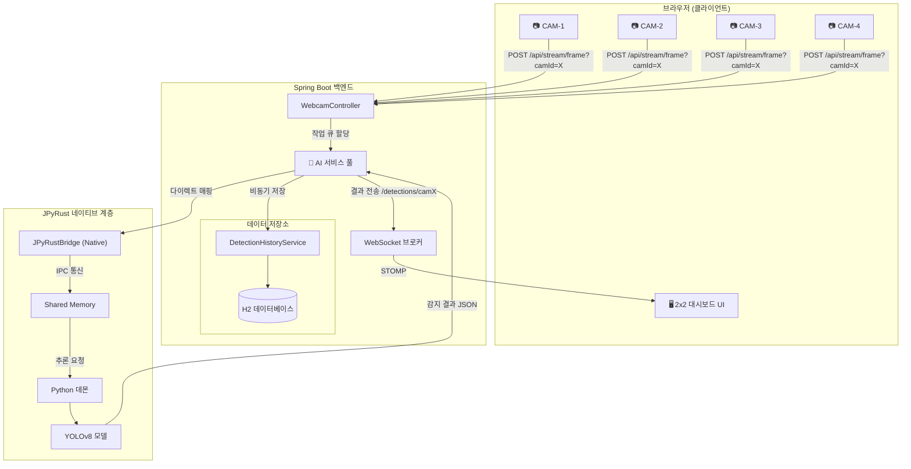

# 🏭 SmartFactory-Vision

> **"실시간 AI 기반 공장 검사 시스템: JPyRust를 이용한 멀티 스트림 아키텍처"**


[](https://openjdk.org/)
[](https://github.com/farmer0010/JPyRust)
[](https://www.python.org/)

[🇺🇸 English Version (README.md)](README.md)

---

## 💡 소개

**SmartFactory-Vision**은 **Spring Boot**와 **JPyRust**를 결합하여 네이티브 수준의 성능을 제공하는 실시간 AI 비전 검사 시스템입니다.

본 프로젝트는 여러 대의 카메라 피드를 동시에 캡처하고, 독립적인 AI 워커 풀을 통해 병렬로 분석하며, 그 결과를 H2 데이터베이스에 저장함과 동시에 웹 대시보드(2x2 그리드)에 실시간으로 전송하는 전 과정을 시연합니다.

---

## ✨ 핵심 기능

| 기능 | 설명 |
|---------|-------------|
| 📹 **멀티 스트림 지원** | 2x2 그리드 레이아웃을 통해 최대 4개 카메라 채널 동시 모니터링 |
| 🧠 **AI 워커 풀** | JPyRust 인스턴스 풀을 관리하여 병렬 이미지 추론 수행 |
| 🗄️ **감지 이력 저장** | 모든 AI 감지 로그를 H2/JPA를 통해 데이터베이스에 자동 저장 |
| ⚡ **고성능 추론** | Python VM 오버헤드 없이 GPU 기준 장당 약 40ms의 고속 추론 |
| 📡 **독립적 토픽** | 카메라별 실시간 WebSocket 토픽 분리를 통한 지연율 최소화 |
| 🖥️ **Sci-Fi UI** | 네온 테마의 대시보드, 실시간 FPS 차트 및 감지 로그 제공 |

---

## 🏗️ 시스템 아키텍처



---

## 📊 성능 벤치마크

| 지표 | 목표 | 결과 |
|--------|:-----:|:------:|
| **최대 스트림 수** | 4 | 확인 완료 (2x2 그리드) |
| **추론 지연율** | < 50ms | 약 42ms (NVIDIA GPU 기준) |
| **저장 지연율** | < 10ms | 비동기 논블로킹 처리 완료 |
| **UI 안정성** | 60 FPS | Chart.js 최적화를 통해 안정적 유지 |

---

## 🚀 시작하기

### 사전 요구 사항
- **Java 17+**
- **웹캠 또는 비전 입력 장치**
- **Windows 10/11** (Shared Memory 사용 최적화)

### 실행 방법
```bash
# 1. 저장소 복제
git clone https://github.com/farmer0010/SmartFactory-Vision.git

# 2. 빌드 및 실행
./gradlew bootRun
```

실행 후 `http://localhost:8080`에 접속하여 멀티 스트림 대시보드를 확인할 수 있습니다.

---

## ⚙️ 시스템 설정

Windows 환경에서의 경로 혼선과 권한 문제를 방지하기 위해 표준화된 경로를 사용합니다.

- **작업 디렉토리**: `~/.jpyrust` (사용자 홈 디렉토리)
- **데이터베이스**: H2 파일 기반 (`~/.jpyrust/historydb`)
- **AI 모델**: YOLOv8n (최초 실행 시 자동 다운로드)

---

## 📜 개발 로드맵

- [x] 멀티 카메라 지원 (2단계 완료)
- [x] 감지 이력 데이터베이스 저장 구현
- [x] 2x2 고해상도 그리드 UI 적용
- [ ] 사용자 정의 모델 학습 연동 기능
- [ ] 분산 워커 지원 (여러 대의 PC로 확장)
- [ ] Docker 배포 지원

---

## 📄 라이선스

MIT License. 자세한 내용은 [LICENSE](LICENSE) 파일을 참조하세요.

---

<p align="center">
  <b>🏭 SmartFactory-Vision</b><br>
  <i>차세대 AI 비전 기술로 스마트 제조 공정을 혁신합니다.</i>
</p>
